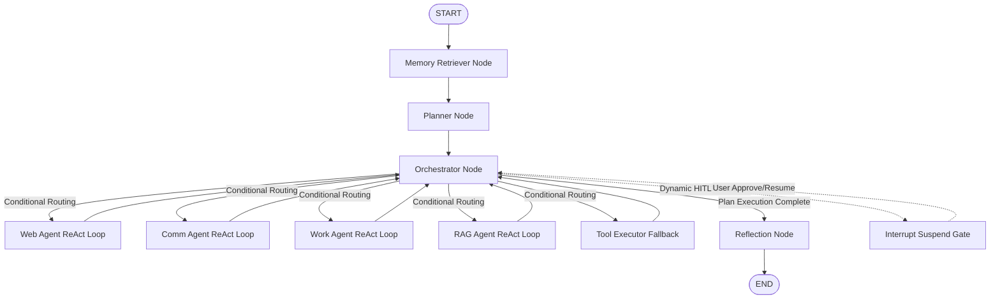

<p align="center">
  
</p>

# Wingman
> **The ultimate personalized AI assistant.** Empowered by deep long-term episodic and semantic memory, autonomous tool orchestration, distributed background tasks, and a visually stunning, minimalist command center.

---

## 🌟 System Architecture Overview

Wingman represents a next-generation agentic design, utilizing a **multi-agent orchestration topology** governed by a state-driven cognitive loop. It natively decouples real-time runtime transactions from heavy scheduling computations and provides transparent debugging telemetry via continuous web socket channels.

### 📂 Monorepo Tree Structure
```txt
wingman/
│
├── backend/
│   ├── app/
│   │   ├── api/v1/       # FastAPI routers (chat, documents, telemetry, memory, auth)
│   │   ├── agents/       # Specialized Module Sub-Agents (Core & Workers)
│   │   ├── graphs/       # LangGraph topology (nodes, routers, & state schema)
│   │   │   ├── execution/# Telemetry helper injects and graph flow controllers
│   │   │   └── nodes/    # Core cognitive modules (Planner, Executor, Reflection)
│   │   ├── tools/        # 3rd party action clients (Google, Slack, RAG, YouTube)
│   │   ├── memory/       # Core drivers (MongoDB, Neo4j, and Chroma Vector)
│   │   ├── services/     # Domain controllers (Auth, Document Extraction, LLM Clients)
│   │   ├── worker/       # Arq Background job scheduler & nocturnal triggers
│   │   ├── core/         # Configuration management and logger modules
│   │   └── prompts/      # Centralized persona template registers
│   │
│   ├── requirements.txt  # Asynchronous python dependency fabric
│   └── Dockerfile        # Python 3.11 slim runner
│
├── frontend/
│   ├── src/              # React 18 codebase scaffolded via Vite
│   │   ├── components/   # Pure UI blocks (ChatPane, Sidebar, HITL Cards)
│   │   ├── hooks/        # Reconnectable WebSocket controllers (useWingmanConnection)
│   │   ├── stores/       # Zustand context stores (useChatStore)
│   │   └── index.css     # Minimalist Space Mono styling directives
│   └── Dockerfile        # Node 20 production build container
│
├── docker-compose.yml    # Full local system stack orchestration
├── .env                  # Local environment secret registries
└── README.md
```

---

## 🏗️ Deep Dive: The Architectural Fabrics

### 1. Multi-Tier Cognitive Memory Fabric
To provide a human-like persistence model, Wingman utilizes three independent storage engines working in orchestration:
*   **💾 Raw Archive Memory (MongoDB):** Asynchronous chronological logging storing every prompt, full assistant payload, and execution metadata (actively recording generating `model` and `reasoning_effort` per interaction).
*   **🕸️ Semantic Fact Memory (Neo4j on Docker):** Graph database preserving extracted episodic nodes, entity relationships, and abstract concepts. Powering long-term contextual synthesis across weeks of chats.
*   **🔍 High-Density Vector DB (ChromaDB on Docker):** Stores dense embeddings generated using the **BAAI/bge-small-en-v1.5** model. Manages the ingestion pipeline that tokenizes user PDFs and text docs into **300-token chunks with 60-character overlap**, retrieving Top-K contexts via a specialized **DocumentRAGTool**.

### 2. The LangGraph Cognitive Loop
All AI execution is governed by a cyclic LangGraph flow that routes task flows dynamically through our specialized agents:


### 3. Real-Time Dynamic Controls
The backend allows the frontend to dynamically inject runtime configuration overrides per message packet:
*   **Model Swapping:** Dynamically switch active inference engines (e.g., standardizing on `GPT-5.4-mini`).
*   **Reasoning Effort Configuration:** Hot-swappable parameter (`Low`, `Medium`, `High`) driving structural depth checks within individual model inference passes.

### 4. Distributed Async Worker Runtime
Periodic system maintenance is decoupled from user API request threads to avoid performance degradation:
*   **System:** Handled by an **Arq** (Redis-backed Async Job Queue) background runner daemon.
*   **Cron Operations:** Triggers every 4 hours to synthesize past MongoDB conversations, extract new episodic semantic connections to sync with Neo4j, and decay expired vector states.

### 5. Multi-Agent Orchestrator Model (CEO & Department Heads)
Wingman's execution engine is built around a centralized **Orchestrator Node (The CEO)** delegating specific tasks to a suite of highly-specialized **Sub-Agents (Department Heads)**. Each Sub-Agent runs a localized **ReAct (Reasoning and Action) loop** with custom prompting, local LLM configurations, and isolated atomic tool access:
*   **🌐 Web Research Agent (`web_agent`):** Searches the internet and resolves public information (Weather, YouTube, WebSearch). Fully localized to India (INR pricing, Indian relevance) by default.
*   **✉️ Communication Agent (`comm_agent`):** Handles drafts and channels (Gmail, Slack, Contacts). Fully personalized to write as **Anuj Mankumare** and strictly verifies destination channels prior to execution.
*   **💼 Workspace Agent (`work_agent`):** Directs personal productivity (Google Calendar, Drive Docs & Sheets, Google Maps routes, and System Alarms/Timers). Proactively returns clickable document links, metric measurement conversions, and suppresses internal UUID strings.
*   **📚 Knowledge/RAG Agent (`rag_agent`):** Queries user-uploaded archives and permanent episodic records via document vector retrieval tools.

#### 🛡️ Idempotent Execution Cache
To prevent redundant API side-effects when the graph gets suspended for a **Human-in-the-Loop (HITL)** approval check, Wingman implements an atomic caching layer:
*   **Caching Strategy:** Every tool execution result is cataloged inside MongoDB's `tool_execution_cache` hashed by `run_id`, `agent_name`, `tool_name`, `arguments`, and its sequence index.
*   **Safe Replay:** When a user approves or resumes a suspended graph, the node replays sequentially. Cached results are fed back instantly without triggering repeated external network hits (e.g. sending a duplicate email or making redundant API calls).

---

## 🛠 Tech Stack & Infrastructure

### Backend Tier
*   **Framework:** FastAPI (Fully Asynchronous ASGI)
*   **Orchestration:** LangGraph & LangChain
*   **Scheduling Engine:** Arq & Redis
*   **Parsers:** `pypdf`, `python-docx`, and `tiktoken` (standardized on `cl100k_base`)
*   **Database Drivers:** Motor (Async Mongo), Neo4j-Python-Driver, ChromaDB-Client

### Frontend Tier
*   **Foundation:** React 18 + Vite + TypeScript
*   **State Manager:** Zustand
*   **Visual Styling:** Pure Black-and-White aesthetics, Space Mono Google Font layout, TailwindCSS grid.
*   **Markdown Support:** `react-markdown` with `remark-gfm` parsing code blocks.

### 🐳 Container Infrastructure Stack
Wingman's orchestration environment is fully modularized using Docker Compose. The localized network architecture decomposes the runtime environment into 7 functional containers:
1.  **🚀 FastAPI Backend (`wingman-backend`):** 
    *   **Role:** Core ASGI application server.
    *   **Functions:** Coordinates cognitive LangGraph execution, services all RESTful endpoints, handles bidirectional real-time WebSocket communication, parses dynamic environment overrides, and emits telemetry stream sequences. It features live hot-reloading by mounting the local backend folder as a Docker volume.
2.  **⚙️ Async Daemon Worker (`wingman-worker`):**
    *   **Role:** Redis-backed Arq scheduler and background worker.
    *   **Functions:** Offloads computationally intensive processes (such as PDF/document ingestion and deep vector embedding parsing) from user request threads. Natively runs scheduled periodic cron jobs (every 4 hours) to synthesize past messages, extract entities, and consolidate memory states without degrading server latency.
3.  **⚛️ React Frontend Client (`wingman-frontend`):**
    *   **Role:** Vite development and production delivery server.
    *   **Functions:** Bundles and renders the visually stunning space-mono black-and-white visual interface. Maintains connection states via Zustand stores, handles dynamic asset loading, and captures localized user metrics.
4.  **💾 Archive Database (`wingman-mongodb`):**
    *   **Role:** Raw document and configuration database.
    *   **Functions:** Ground-truth persistence layer for chronological conversation histories, global settings schemas, and active credential properties. It also hosts the critical idempotent caching ledger `tool_execution_cache` to safeguard integrations from repeated calls during graph replays.
5.  **🕸️ Graph Memory Database (`wingman-neo4j`):**
    *   **Role:** Episodic and semantic knowledge graph.
    *   **Functions:** Maps synthesized episodic facts, user behaviors, and abstract concepts into connected nodes and relations. Enables multi-turn factual retrieval across disparate conversation sessions.
6.  **⚡ Cache & Queue Broker (`wingman-redis`):**
    *   **Role:** High-speed in-memory database and message broker.
    *   **Functions:** Powers the high-throughput task queue for the isolated Arq workers and caches transient transaction states between frontend and backend.
7.  **🔍 Local Vector Storage (`wingman-chromadb`):**
    *   **Role:** Chromadb vector embeddings database.
    *   **Functions:** Hosts semantic vector indices generated from uploaded documents using text-embedding models. Manages isolated user knowledge collections, running high-speed semantic searches for RAG tools.

---

## 🏁 Quickstart Guide

### 🐳 Method 1: Run Stack via Docker Compose (Recommended)
Clone the repository, boot all 7 containers simultaneously (FastAPI, React Frontend, MongoDB, Neo4j, Redis, ChromaDB, and Arq Worker), and configure all credentials seamlessly directly from the UI onboarding setup assistant (no manual `.env` file editing required!):
```bash
# 1. Clone and enter repository
git clone https://github.com/PRIME-07/Wingman.git
cd Wingman

# 2. Boot the complete stack
docker compose up --build
```
#### Network Mappings:
*   **🚀 Main Command Center:** [http://localhost:5173](http://localhost:5173)
*   **⚡ FastAPI Swagger Docs:** [http://localhost:8000/docs](http://localhost:8000/docs)
*   **🕸️ Neo4j Database Console:** [http://localhost:7474](http://localhost:7474)

### 💻 Method 2: Running Local Development (Without Docker)

#### A. Setup Backend 🐍
```bash
# 1. Navigate into backend space
cd backend

# 2. Activate local virtual environment and install
pip install -r requirements.txt

# 3. Launch development server
uvicorn app.main:app --reload --host 127.0.0.1 --port 8000
```

#### B. Setup Background Worker ⚙️
```bash
# Inside backend folder, spin up the isolated Arq scheduler
arq app.worker.arq_worker.WorkerSettings
```

#### C. Setup Frontend ⚛️
```bash
# 1. Navigate to UI space
cd frontend

# 2. Install npm packages
npm install

# 3. Boot Vite dev listener
npm run dev
```

---

## 🩺 Interface Reference & API Surfaces

### WebSocket Real-time Pipelines
*   `WS /api/v1/chat/ws`
    *   **Function:** Central bi-directional prompt execution pipe.
    *   **Events Sent:** `prompt`, `resume` (for HITL approvals).
    *   **Events Received:** `hitl_suspend`, `final_response`.
*   `WS /api/v1/telemetry/ws`
    *   **Function:** Read-only system stream channel.
    *   **Events Emitted:** `token_stream` (real-time chunk delivery), `node_entry`, `node_exit`, `tool_start`, `tool_end`.

### Restful Core Actions
*   `GET /health`: Microservice reachability check.
*   `POST /api/v1/documents/upload`: Stream file binaries into ChromaDB embeddings.
*   `GET /api/v1/documents`: Retrieve registry log of uploaded user knowledge sources.
*   `DELETE /api/v1/documents/{doc_id}`: Erases vector indices permanently.

---

## 🔧 Detailed Setup Guide

### 🌐 Zero-Config Onboarding (Easiest)
Wingman features a complete **Zero-Config Onboarding workflow** built directly into the user interface. You don't have to deal with terminal editors, `.env` file configurations, or container restarts! 

#### 1. First-Time Setup Assistant Wizard
When you boot Wingman and open the interface for the first time, you will be welcomed by an interactive **Setup Assistant**. This wizard walks you through setting up all necessary environment variables:
*   **LLM Engine Credentials:** Enter your OpenAI API key or other model keys.
*   **Memory & Vector Databases:** Easily configure your local database properties to enable persistent long-term episodic memory, graph storage, and vector retrieval.
*   **Integrations & Tooling:** Enter API credentials for search engines, maps, weather feeds, and YouTube to power the agent's real-time tools.

#### 2. Reconfiguring or Accessing Settings Later
Need to change an API key, add a new integration, or verify your connection status later? 
*   **Access Path:** Simply click the **Plug/Socket Icon** (Integrations Tab) on the leftmost Activity Bar of the sidebar.
*   **Configure Button:** Click the **"Configure"** button in the top-right corner of the pane.
*   This will bring back the Setup Assistant panel, allowing you to update any environment variables, credentials, or third-party connections on the fly!

---

### Google Cloud Setup
1. Go to the [Google Cloud Console](https://console.cloud.google.com/).
2. Create a new project named **Wingman**.
3. Go to **APIs & Services > Library** and enable:
   - Google Drive API
   - Google Calendar API
   - Google Maps JavaScript API
   - YouTube Data API v3
4. Go to **APIs & Services > OAuth consent screen**:
   - Choose **External**.
   - Add your email and developer contact info.
5. Go to **APIs & Services > Credentials**:
   - Click **Create Credentials > OAuth client ID**.
   - Application type: **Web application**.
   - Authorized redirect URIs: `http://localhost:8000/api/v1/auth/callback/google`.
6. Copy the **Client ID** and **Client Secret** into the Wingman Setup Assistant.

### Slack Integration
1. Go to [Slack App Dashboard](https://api.slack.com/apps).
2. Click **Create New App > From an app manifest**.
3. Select your workspace and paste the YAML provided in the Wingman Setup Assistant.
4. Go to **Install App** and click **Install to Workspace**.
5. Copy the **Bot User OAuth Token** (starts with `xoxb-`) into Wingman.

### ChromaDB Vector Memory (Local)
ChromaDB is executed entirely as a local microservice (`wingman-chromadb`) within the Docker Compose network. 
*   **No API Keys Required:** Unlike external vector databases, local ChromaDB does not require subscription fees or cloud configurations.
*   **Embedding Model:** Automatically processes document tokenization and uploads using the premium, localized open-source **BAAI/bge-small-en-v1.5** model.

### Neo4j Graph Memory (Local)
The semantic graph database is run locally via the `wingman-neo4j` Docker container.
*   **Default Credentials:** Spuns up pre-configured with username `neo4j` and password `password`.
*   **Local Management Console:** You can inspect your episodic nodes, entities, and relationship facts live by navigating to [http://localhost:7474](http://localhost:7474).

### LLM Engine Setup
1. Go to [OpenAI API Keys](https://platform.openai.com/api-keys).
2. Create a new secret key.
3. **Disclaimer:** Currently, Wingman is compatible with **OpenAI only**. Please ensure your key has credits and access to `gpt-4o-mini` and `gpt-5.4-mini`.
4. Paste the key into the Engine tab in Wingman.
