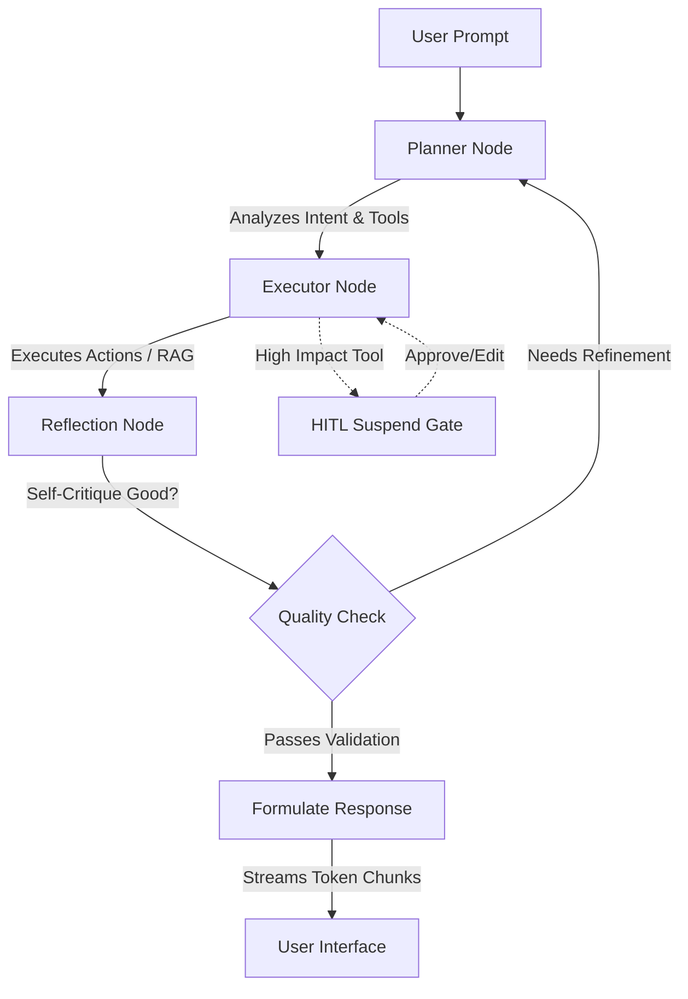

# 🦅 Wingman
> **The ultimate personalized AI operating system.** Empowered by deep long-term episodic and semantic memory, autonomous tool orchestration, distributed background tasks, and a visually stunning, minimalist command center.

---

## 🌟 System Architecture Overview

Wingman represents the next-generation of agentic OS design, utilizing a **multi-agent orchestration topology** governed by a state-driven cognitive loop. It natively decouples real-time runtime transactions from heavy scheduling computations and provides transparent debugging telemetry via continuous web socket channels.

### 📂 Monorepo Tree Structure
```txt
wingman/
│
├── backend/
│   ├── app/
│   │   ├── api/v1/       # FastAPI routers (chat, documents, telemetry, memory, auth)
│   │   ├── agents/       # Specialized Module Sub-Agents (Core & Workers)
│   │   ├── graphs/       # LangGraph topology (nodes, routers, & state schema)
│   │   │   ├── execution/# Telemetry helper injects and graph flow controllers
│   │   │   └── nodes/    # Core cognitive modules (Planner, Executor, Reflection)
│   │   ├── tools/        # 3rd party action clients (Google, Slack, RAG, YouTube)
│   │   ├── memory/       # Core drivers (MongoDB, Neo4j, and Pinecone Vector)
│   │   ├── services/     # Domain controllers (Auth, Document Extraction, LLM Clients)
│   │   ├── worker/       # Arq Background job scheduler & nocturnal triggers
│   │   ├── core/         # Configuration management and logger modules
│   │   └── prompts/      # Centralized persona template registers
│   │
│   ├── requirements.txt  # Asynchronous python dependency fabric
│   └── Dockerfile        # Python 3.11 slim runner
│
├── frontend/
│   ├── src/              # React 18 codebase scaffolded via Vite
│   │   ├── components/   # Pure UI blocks (ChatPane, Sidebar, HITL Cards)
│   │   ├── hooks/        # Reconnectable WebSocket controllers (useWingmanConnection)
│   │   ├── stores/       # Zustand context stores (useChatStore)
│   │   └── index.css     # Minimalist Space Mono styling directives
│   └── Dockerfile        # Node 20 production build container
│
├── docker-compose.yml    # Full local system stack orchestration
├── .env                  # Local environment secret registries
└── README.md
```

---

## 🏗️ Deep Dive: The Architectural Fabrics

### 1. Multi-Tier Cognitive Memory Fabric
To provide a human-like persistence model, Wingman utilizes three independent storage engines working in orchestration:
*   **💾 Raw Archive Memory (MongoDB):** Asynchronous chronological logging storing every prompt, full assistant payload, and execution metadata (actively recording generating `model` and `reasoning_effort` per interaction).
*   **🕸️ Semantic Fact Memory (Neo4j Aura):** Graph database preserving extracted episodic nodes, entity relationships, and abstract concepts. Powering long-term contextual synthesis across weeks of chats.
*   **🔍 High-Density Vector DB (Pinecone):** Stores dense embeddings generated using **llama-text-embed-v2**. Manages the ingestion pipeline that tokenizes user PDFs and text docs into **300-token chunks with 60-character overlap**, retrieving Top-K contexts via a specialized **DocumentRAGTool**.

### 2. The LangGraph Cognitive Loop
All AI execution is governed by a cyclic LangGraph flow that moves beyond traditional linear LLM prompting:


### 3. Real-Time Dynamic Controls
The backend allows the frontend to dynamically inject runtime configuration overrides per message packet:
*   **Model Swapping:** Dynamically switch active inference engines (e.g., standardizing on `GPT-5.4-mini`).
*   **Reasoning Effort Configuration:** Hot-swappable parameter (`Low`, `Medium`, `High`) driving structural depth checks within individual model inference passes.

### 4. Distributed Async Worker Runtime
Nightly system maintenance is decoupled from user API request threads to avoid performance degradation:
*   **System:** Handled by an **Arq** (Redis-backed Async Job Queue) background runner daemon.
*   **Cron Operations:** Triggers at 03:00 AM daily to synthesize the day's MongoDB conversations, inject new connections into Neo4j, and decay expired vector states.

---

## 🛠 Tech Stack & Infrastructure

### Backend Tier
*   **Framework:** FastAPI (Fully Asynchronous ASGI)
*   **Orchestration:** LangGraph & LangChain
*   **Scheduling Engine:** Arq & Redis
*   **Parsers:** `pypdf`, `python-docx`, and `tiktoken` (standardized on `cl100k_base`)
*   **Database Drivers:** Motor (Async Mongo), Neo4j-Python-Driver, Pinecone-Client

### Frontend Tier
*   **Foundation:** React 18 + Vite + TypeScript
*   **State Manager:** Zustand
*   **Visual Styling:** Pure Black-and-White aesthetics, Space Mono Google Font layout, TailwindCSS grid.
*   **Markdown Support:** `react-markdown` with `remark-gfm` parsing code blocks.

---

## 🏁 Quickstart Guide

### 🐳 Step 1: Run Stack via Docker Compose (Recommended)
Clone the repository, ensure your root `.env` credentials are set, and boot all 5 micro-containers simultaneously (FastAPI, React Frontend, MongoDB, Neo4j, and Redis):
```bash
# 1. Clone and enter repository
git clone <YOUR_REPOSITORY_URL>
cd Wingman

# 2. Boot the complete stack
docker compose up --build
```
#### Network Mappings:
*   **🚀 Main Command Center:** [http://localhost:5173](http://localhost:5173)
*   **⚡ FastAPI Swagger Docs:** [http://localhost:8000/docs](http://localhost:8000/docs)
*   **🕸️ Neo4j Database Console:** [http://localhost:7474](http://localhost:7474)

### 💻 Step 2: Running Local Development (Without Docker)

#### A. Setup Backend 🐍
```bash
# 1. Navigate into backend space
cd backend

# 2. Activate local virtual environment and install
pip install -r requirements.txt

# 3. Launch development server
uvicorn app.main:app --reload --host 127.0.0.1 --port 8000
```

#### B. Setup Background Worker ⚙️
```bash
# Inside backend folder, spin up the isolated Arq scheduler
arq app.worker.arq_worker.WorkerSettings
```

#### C. Setup Frontend ⚛️
```bash
# 1. Navigate to UI space
cd frontend

# 2. Install npm packages
npm install

# 3. Boot Vite dev listener
npm run dev
```

---

## 🩺 Interface Reference & API Surfaces

### WebSocket Real-time Pipelines
*   `WS /api/v1/chat/ws`
    *   **Function:** Central bi-directional prompt execution pipe.
    *   **Events Sent:** `prompt`, `resume` (for HITL approvals).
    *   **Events Received:** `hitl_suspend`, `final_response`.
*   `WS /api/v1/telemetry/ws`
    *   **Function:** Read-only system stream channel.
    *   **Events Emitted:** `token_stream` (real-time chunk delivery), `node_entry`, `node_exit`, `tool_start`, `tool_end`.

### Restful Core Actions
*   `GET /health`: Microservice reachability check.
*   `POST /api/v1/documents/upload`: Stream file binaries into Pinecone embeddings.
*   `GET /api/v1/documents`: Retrieve registry log of uploaded user knowledge sources.
*   `DELETE /api/v1/documents/{doc_id}`: Erases vector indices permanently.
